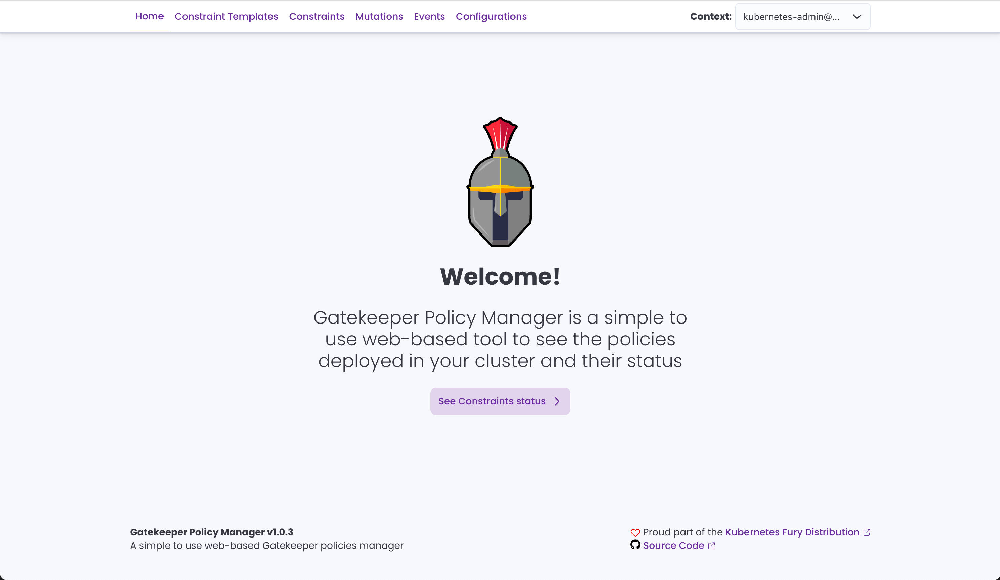
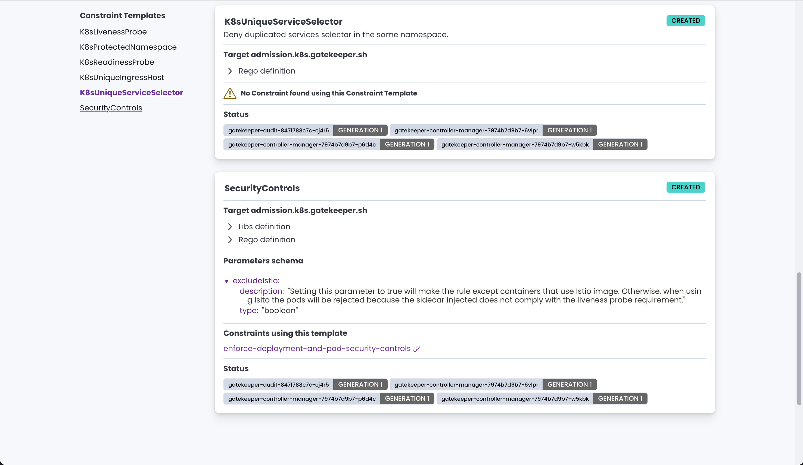
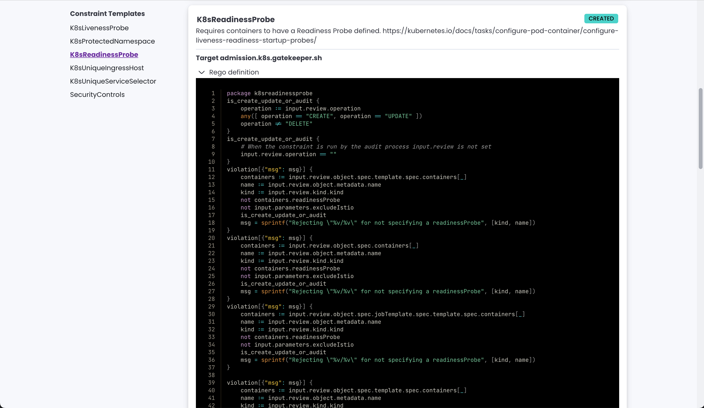
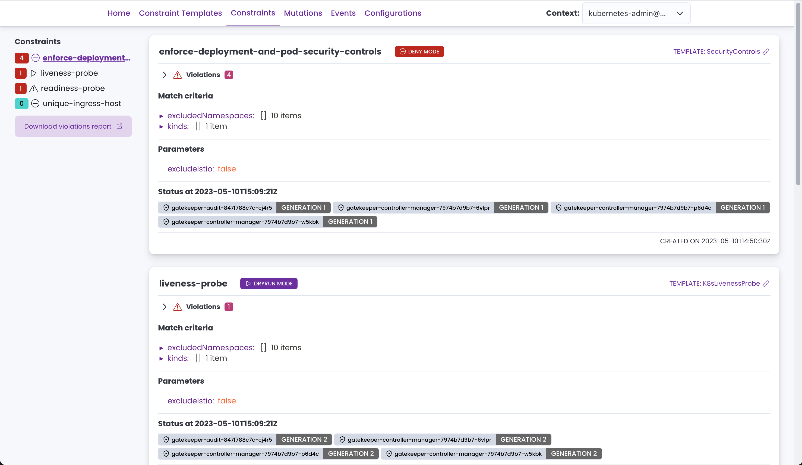
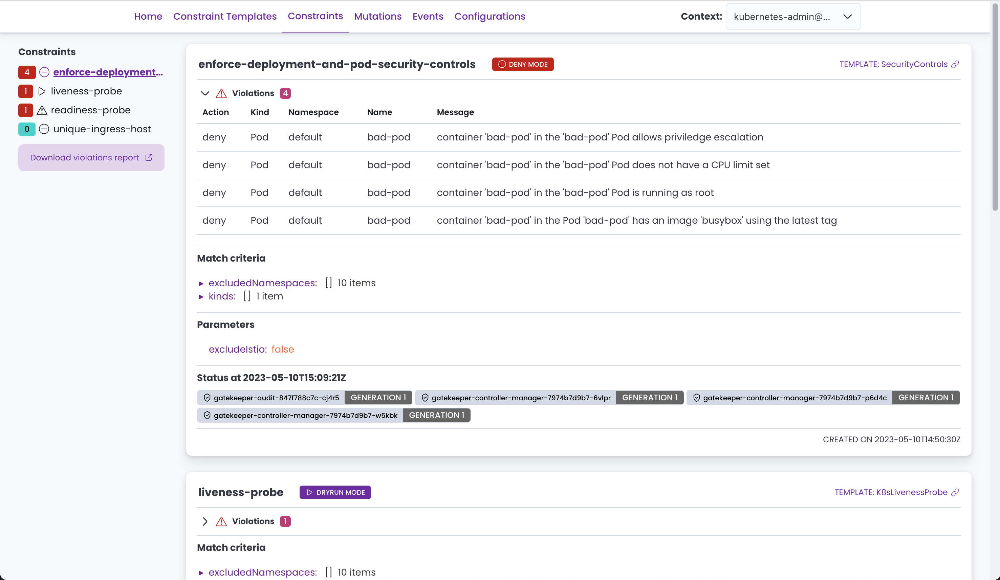
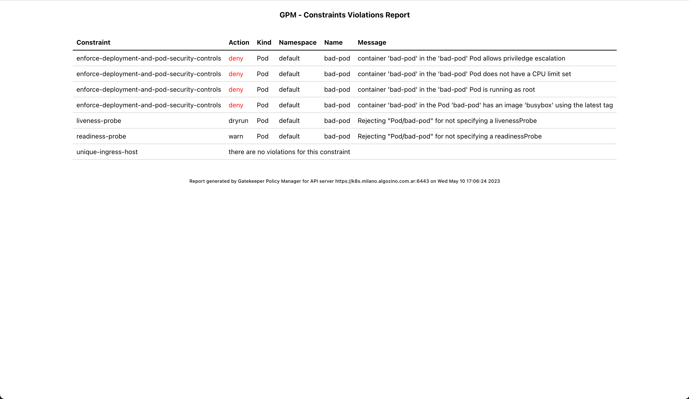
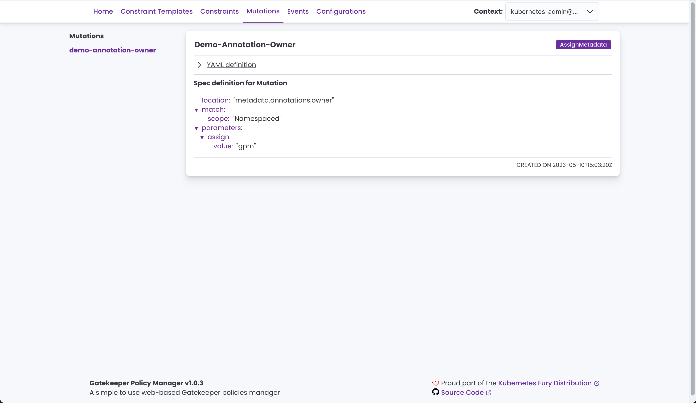
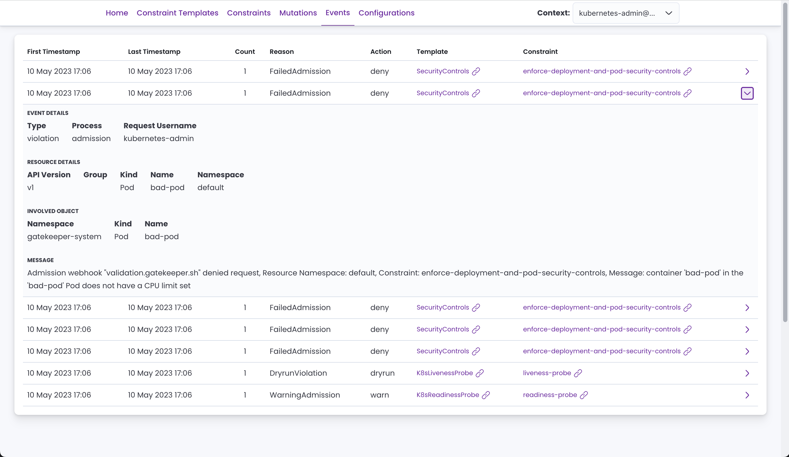
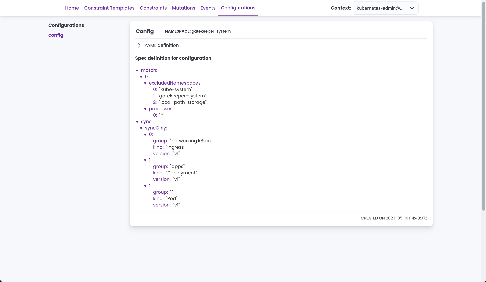
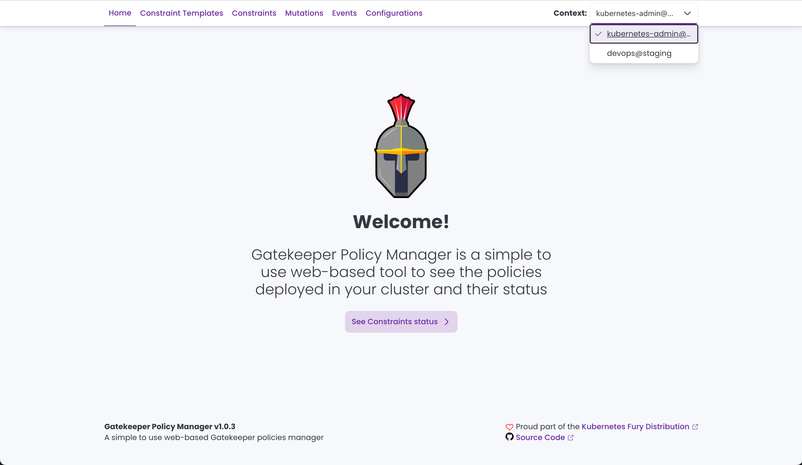

<!-- markdownlint-disable MD033 -->
<h1>
    
    Gatekeeper Policy Manager (GPM)
</h1>
<!-- markdownlint-enable MD033 -->

[](https://ci.sighup.io/sighupio/gatekeeper-policy-manager)


**Gatekeeper Policy Manager** is a simple *read-only* web UI for viewing OPA Gatekeeper policies' status in a Kubernetes Cluster.

The target Kubernetes Cluster can be the same where GPM is running or some other [remote cluster(s) using a `kubeconfig` file](#multi-cluster-support). You can also run GPM [locally in a client machine](#running-locally) and connect to a remote cluster.

GPM lets you see in detail:

- **Constraint Templates** with their rego code.
- **Constraints** with their current status, violations, enforcement action, matches definitions, etc.
- **Mutations** defined and their details.
- **Events** emitted by OPA Gatekeeper (alpha feature).
- Gatekeeper **Configuration** custom resource values.

[You can see some screenshots below ⤵](#screenshots).

## Requirements

You'll need OPA Gatekeeper running in your cluster and at least some constraint templates and constraints defined to take advantage of this tool.

ℹ You can easily deploy Gatekeeper to your cluster using the (also open source) [Kubernetes Fury OPA](https://github.com/sighupio/fury-kubernetes-opa) module.

## Deploying GPM

### Deploy using Kustomize

To deploy Gatekeeper Policy Manager to your cluster, apply the provided [`kustomization`](kustomization.yaml) file running the following command:

```shell
kubectl apply -k .
```

By default, this will create a deployment and a service both with the name `gatekeper-policy-manager` in the `gatekeeper-system` namespace. We invite you to take a look into the `kustomization.yaml` file to do further configuration.

> 💡 GPM can run as a POD in a Kubernetes cluster or locally with a `kubeconfig` file. It will try its best to autodetect the correct configuration.

Once you've deployed the application, if you haven't set up an ingress, you can access the web UI using port-forward:

```bash
kubectl -n gatekeeper-system port-forward  svc/gatekeeper-policy-manager 8080:80
```

Then access it with your browser by visiting [http://127.0.0.1:8080](http://127.0.0.1:8080).

### Deploy using Helm

It is also possible to deploy GPM using the [provided Helm Chart](./chart).

First create a values file, for example `my-values.yaml`, with your custom values for the release. See the [chart's readme](./chart/README.md) and the [default values.yaml](./chart/values.yaml) for more information.

Then, execute:

```bash
helm repo add gpm https://sighupio.github.io/gatekeeper-policy-manager
helm upgrade --install --namespace gatekeeper-system --set image.tag=v2.0.0-alpha1 --values my-values.yaml gatekeeper-policy-manager gpm/gatekeeper-policy-manager
```

> don't forget to replace `my-values.yaml` with the path to your values file.

## Running locally

GPM can also be run locally using Docker (or any other container runtime) and a `kubeconfig`. Assuming that the `kubeconfig` file you want to use is located at `~/.kube/config` the command to run GPM locally would be:

```bash
docker run -v ~/.kube/config:/home/nonroot/.kube/config -p 8080:8080 quay.io/sighup/gatekeeper-policy-manager:v2.0.0-alpha1
```

Then access it with your browser by visiting [http://127.0.0.1:8080](http://127.0.0.1:8080).

> You can also run the app binary directly, see the [development section](#development) for further information.

## Configuration

GPM is a stateless application, but it can be configured using environment variables. The possible configurations are:

| Env Var Name         | Description                                                                                                                                                                                                                       | Default              |
| -------------------- | --------------------------------------------------------------------------------------------------------------------------------------------------------------------------------------------------------------------------------- | -------------------- |
| `GPM_LISTEN_ADDRESS` | Server listen address                                                                                                                                                                                                             | `:8080`              |
| `GPM_LOG_LEVEL`      | Log level (`DEBUG`, `INFO`, `WARN`, `ERROR`, `OFF`)                                                                                                                                                                               | `INFO`               |
| `GPM_EVENTS_SOURCE`  | Used to filter out events by the defined source                                                                                                                                                                                   | `gatekeeper-webhook` |
| `KUBECONFIG`         | Path to a [kubeconfig](https://kubernetes.io/docs/concepts/configuration/organize-cluster-access-kubeconfig/) file, if provided while running inside a cluster this configuration file will be used instead of the cluster's API. | `$HOME/.kube/config` |

### Multi-cluster support

GPM supports viewing information from more than one cluster. Multi-cluster support is achieved by using a `kubeconfig` with more than one context, where each context points to a different cluster. GPM will let you choose the context (cluster) from the UI.

If you want to run GPM in a cluster but with multi-cluster support, do as follows:

1. Mounting a `kubeconfig` file in GPM's pod(s) with the cluster access configuration.
2. Setting the environment variable `KUBECONFIG` value with the path to the mounted `kubeconfig` file. Or you can simply mount it in `/home/nonroot/.kube/config` and GPM will detect it automatically.

> ⚠️ Please remember that the user for the clusters should have the proper permissions. You can use the [`manifests/rabc.yaml`](manifests/rbac.yaml) file as reference.
>
> Also note that the cluster where GPM is running should be able to reach the other clusters, i.e. network connectivity.

When you run GPM locally, you are already using a `kubeconfig` file to connect to the clusters, you should see all your defined contexts and be able to switch between them easily from the UI.

#### AWS IAM Authentication

If you want to use a Kubeconfig with IAM Authentication, you'll need to customize GPM's container image because the IAM authentication uses external AWS binaries that are not included by default in the image.

You can customize the container image with a `Dockerfile` like the following:

```Dockerfile
FROM curlimages/curl:7.81.0 as downloader
RUN curl https://github.com/kubernetes-sigs/aws-iam-authenticator/releases/download/v0.5.5/aws-iam-authenticator_0.5.5_linux_amd64 --output /tmp/aws-iam-authenticator
RUN chmod +x /tmp/aws-iam-authenticator

FROM quay.io/sighup/gatekeeper-policy-manager:v2.0.0-alpha1
COPY --from=downloader --chown=root:root /tmp/aws-iam-authenticator /usr/local/bin/
```

You may need to add also the `aws` CLI for debugging purposes, you can use the same approach as before.

> ℹ️ Make sure that your `kubeconfig` has the `apiVersion` set as `client.authentication.k8s.io/v1beta1`
>
> You can read more [in this issue](https://github.com/sighupio/gatekeeper-policy-manager/issues/330).

## Screenshots

<!-- markdownlint-disable MD033 -->
<a href="screenshots/home.png"></a>
<a href="screenshots/constraint-templates-01.png"></a>
<a href="screenshots/constraint-templates-02.png"></a>
<a href="screenshots/constraints-01.png"></a>
<a href="screenshots/constraints-02.png"></a>
<a href="screenshots/violations-report.png"></a>
<a href="screenshots/mutations.png"></a>
<a href="screenshots/events.png"></a>
<a href="screenshots/configurations.png"></a>
<a href="screenshots/multicluster.png"></a>
<!-- markdownlint-enable MD033 -->

## Development

GPM is written in Go using the Echo framework for the backend and React with Elastic UI and the Fury theme for the frontend.

To develop GPM, the following commands should get you ready to start hacking:

```bash
# Build Frontend and copy over to static folder
$ pushd web-client
$ yarn install && yarn build
$ cp -r build/* ../static-content/
$ popd
# Install the Backend dependencies
$ go mod download
# Run the development server
$ APP_ENV=development GPM_LOG_LEVEL=DEBUG go run main.go
```

> 💡 Access to a Kubernetes cluster with OPA Gatekeeper deployed is recommended to debug the application.

## Contributing

Please, let us know if you are using GPM and what features would you like to have by creating an issue here on GitHub 💪🏻

To contribute to GPM's development you can pick one of the open issues and work on it, it is better if you write on the issue letting us know first.

Once you are happy with your work, feel free to open a Pull Request.

> We try to stick to [conventional commits](https://www.conventionalcommits.org/en/v1.0.0/) when writing commit messages.
