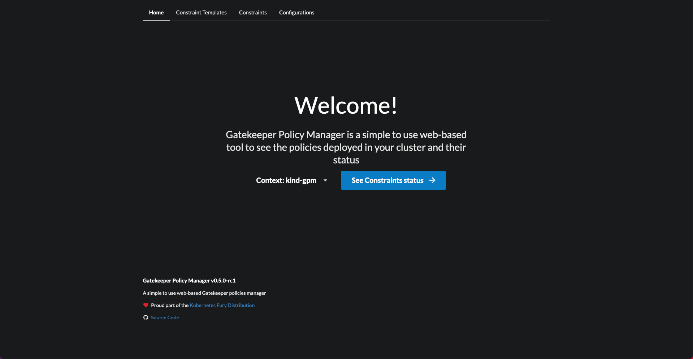
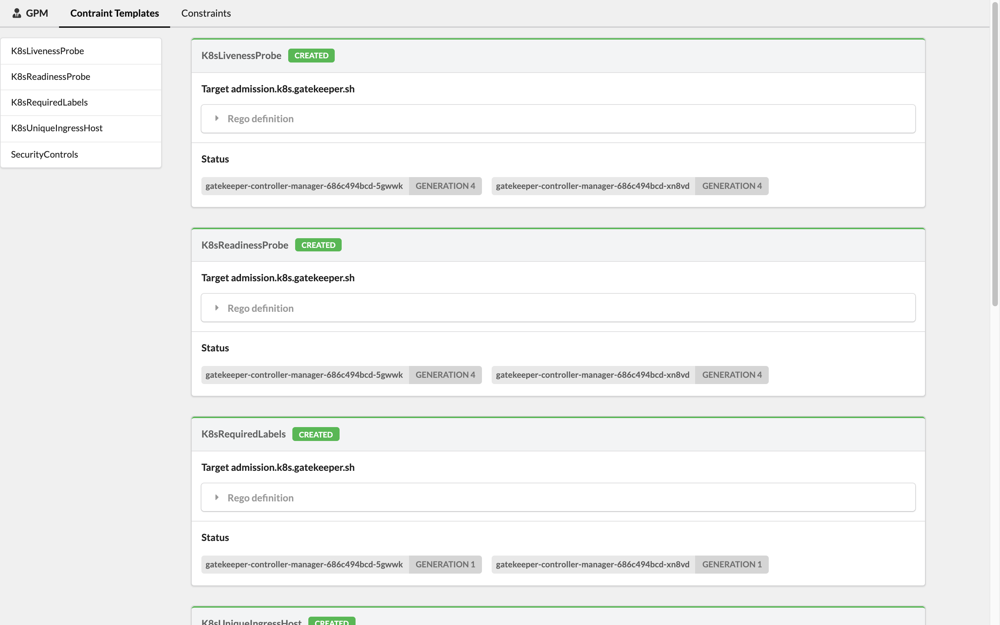
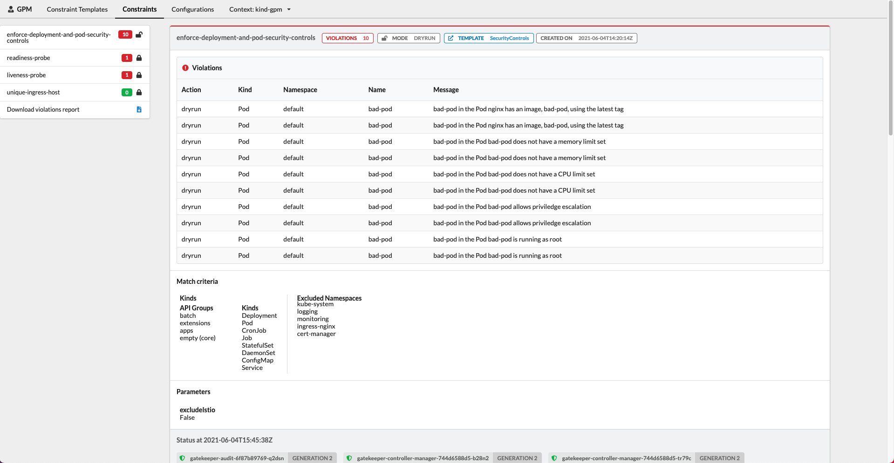
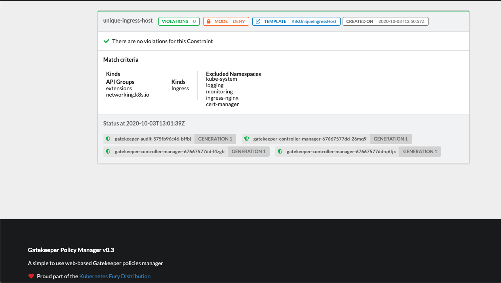
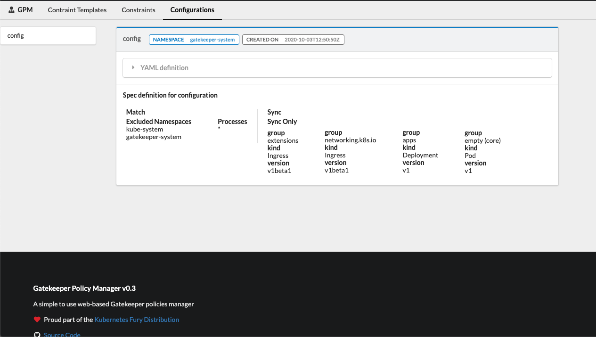
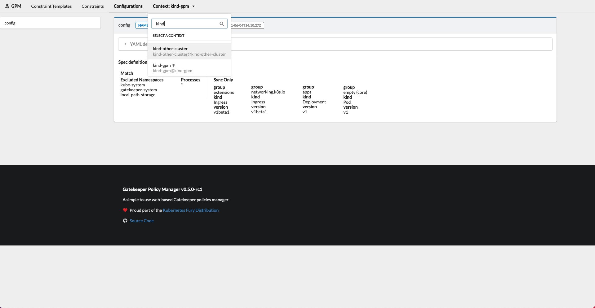

<!-- markdownlint-disable MD033 -->
<h1>
    
    Gatekeeper Policy Manager (GPM)
</h1>
<!-- markdownlint-enable MD033 -->

[](https://ci.sighup.io/sighupio/gatekeeper-policy-manager)


**Gatekeeper Policy Manager** is a simple *read-only* web UI for viewing OPA Gatekeeper policies' status in a Kubernetes Cluster.

The target Kubernetes Cluster can be the same where GPM is running or some other [remote cluster(s) using a `kubeconfig` file](#multi-cluster-support). You can also run GPM [locally in a client machine](#running-locally) and connect to a remote cluster.

GPM can display all the defined **Constraint Templates** with their rego code, all the Gatekeeper Configuration CRDs, and all the **Constraints** with their current status, violations, enforcement action, matches definitions, etc.

[You can see some screenshots below](#screenshots).

## Requirements

You'll need OPA Gatekeeper running in your cluster and at least some constraint templates and constraints defined to take advantage of this tool.

ℹ You can easily deploy Gatekeeper to your cluster using the (also open source) [Kubernetes Fury OPA](https://github.com/sighupio/fury-kubernetes-opa) module.

## Deploying GPM

### Deploy using Kustomize

To deploy Gatekeeper Policy Manager to your cluster, apply the provided [`kustomization`](kustomization.yaml) file running the following command:

```shell
kubectl apply -k .
```

By default, this will create a deployment and a service both with the name `gatekeper-policy-manager` in the `gatekeeper-system` namespace. We invite you to take a look into the `kustomization.yaml` file to do further configuration.

> The app can be run as a POD in a Kubernetes cluster or locally with a `kubeconfig` file. It will try its best to autodetect the correct configuration.

Once you've deployed the application, if you haven't set up an ingress, you can access the web-UI using port-forward:

```bash
kubectl -n gatekeeper-system port-forward  svc/gatekeeper-policy-manager 8080:80
```

Then access it with your browser on: [http://127.0.0.1:8080](http://127.0.0.1:8080)

### Deploy using Helm

It is also possible to deploy GPM using the [provided Helm Chart](./chart).

First create a values file, for example `my-values.yaml`, with your custom values for the release. See the [chart's readme](./chart/README.md) and the [default values.yaml](./chart/values.yaml) for more information.

Then, execute:

```bash
helm repo add gpm https://sighupio.github.io/gatekeeper-policy-manager
helm upgrade --install --namespace gatekeeper-system --set image.tag=v1.0.8 --values my-values.yaml gatekeeper-policy-manager gpm/gatekeeper-policy-manager
```

> don't forget to replace `my-values.yaml` with the path to your values file.

## Running locally

GPM can also be run locally using docker and a `kubeconfig`, assuming that the `kubeconfig` file you want to use is located at `~/.kube/config` the command to run GPM locally would be:

```bash
docker run -v ~/.kube/config:/home/gpm/.kube/config -p 8080:8080 quay.io/sighup/gatekeeper-policy-manager:v1.0.8
```

Then access it with your browser on: [http://127.0.0.1:8080](http://127.0.0.1:8080)

> You can also run the flask app directly, see the [development section](#development) for further information.

## Configuration

GPM is a stateless application, but it can be configured using environment variables. The possible configurations are:

| Environment Variable Name         | Description                                                                                                                                                                                                                       | Default                |
| --------------------------------- | --------------------------------------------------------------------------------------------------------------------------------------------------------------------------------------------------------------------------------- | ---------------------- |
| `GPM_SECRET_KEY`                  | The secret key used to generate tokens. **Change this value in production**.                                                                                                                                                      | `g8k1p3rp0l1c7m4n4g3r` |
| `KUBECONFIG`                      | Path to a [kubeconfig](https://kubernetes.io/docs/concepts/configuration/organize-cluster-access-kubeconfig/) file, if provided while running inside a cluster this configuration file will be used instead of the cluster's API. |
| `GPM_LOG_LEVEL`                   | Log level (see [python logging docs](https://docs.python.org/2/library/logging.html#levels) for available levels)                                                                                                                 | `INFO`                 |
| `GPM_AUTH_ENABLED`                | Enable Authentication current options: "Anonymous", "OIDC"                                                                                                                                                                        | Anonymous              |
| `GPM_PREFERRED_URL_SCHEME`        | URL scheme to be used while generating links.                                                                                                                                                                                     | `http`                 |
| `GPM_OIDC_REDIRECT_DOMAIN`        | The domain where GPM is being running. This is where the client will be redirected after authenticating                                                                                                                           |                        |
| `GPM_OIDC_CLIENT_ID`              | The Client ID used to authenticate against the OIDC Provider                                                                                                                                                                      |                        |
| `GPM_OIDC_CLIENT_SECRET`          | The Client Secret used to authenticate against the OIDC Provider (optional)                                                                                                                                                       |                        |
| `GPM_OIDC_ISSUER`                 | OIDC Issuer hostname (required if OIDC Auth is enabled)                                                                                                                                                                           |                        |
| `GPM_OIDC_AUTHORIZATION_ENDPOINT` | OIDC Authorization Endpoint (optional, setting this parameter disables the discovery of the rest of the provider configuration, set all the other values also if setting this one)                                                |                        |
| `GPM_OIDC_JWKS_URI`               | OIDC JWKS URI (optional, setting this parameter disables the discovery of the rest of the provider configuration, set all the other values also if setting this one)                                                              |                        |
| `GPM_OIDC_TOKEN_ENDPOINT`         | OIDC TOKEN Endpoint (optional, setting this parameter disables the discovery of the rest of the provider configuration, set all the other values also if setting this one)                                                        |                        |
| `GPM_OIDC_INTROSPECTION_ENDPOINT` | OIDC Introspection Endpoint (optional, setting this parameter disables the discovery of the rest of the provider configuration, set all the other values also if setting this one)                                                |                        |
| `GPM_OIDC_USERINFO_ENDPOINT`      | OIDC Userinfo Endpoint (optional, setting this parameter disables the discovery of the rest of the provider configuration, set all the other values also if setting this one)                                                     |                        |
| `GPM_OIDC_END_SESSION_ENDPOINT`   | OIDC End Session Endpoint (optional, setting this parameter disables the discovery of the rest of the provider configuration, set all the other values also if setting this one)                                                  |                        |

> ⚠️ Please notice that OIDC Authentication is in beta state. It has been tested to work with Keycloak as a provider.
>
> These environment variables are already provided and ready to be set in the [`manifests/enable-oidc.yaml`](manifests/enable-oidc.yaml) file.

### Multi-cluster support

Since `v1.0.8` GPM has basic multi-cluster support when using a `kubeconfig` with more than one context. GPM will let you chose the context right from the UI.

If you want to run GPM in a cluster but with multi-cluster support, it's as easy as mounting a `kubeconfig` file in GPM's pod(s) with the cluster access configuration and set the environment variable `KUBECONFIG` with the path to the mounted `kubeconfig` file. Or you can simply mount it in `/home/gpm/.kube/config` and GPM will detect it automatically.

> Please remember that the user for the clusters should have the right permissions. You can use the [`manifests/rabc.yaml`](manifests/rbac.yaml) file as reference.
>
> Also note that the cluster where GPM is running should be able to reach the other clusters.

When you run GPM locally, you are already using a `kubeconfig` file  to connect to the clusters, now you should see all your defined contexts and you can switch between them easily from the UI.

#### AWS IAM Authentication

If you want to use a Kubeconfig with IAM Authentication, you'll need to customize GPM's container image because the IAM authentication uses external AWS binaries that are not included by default in the image.

You can customize the container image with a `Dockerfile` like the following:

```Dockerfile
FROM curlimages/curl:7.81.0 as downloader
RUN curl https://github.com/kubernetes-sigs/aws-iam-authenticator/releases/download/v0.5.5/aws-iam-authenticator_0.5.5_linux_amd64 --output /tmp/aws-iam-authenticator
RUN chmod +x /tmp/aws-iam-authenticator
FROM quay.io/sighup/gatekeeper-policy-manager:v1.0.8
COPY --from=downloader --chown=root:root /tmp/aws-iam-authenticator /usr/local/bin/
```

You may need to add also the `aws` CLI, you can use the same approach as before.

Make sure that your `kubeconfig` has the `apiVersion` set as `client.authentication.k8s.io/v1beta1`

You can read more [in this issue](https://github.com/sighupio/gatekeeper-policy-manager/issues/330).

## Screenshots















## Development

GPM is written in Python using the Flask framework for the backend and React with Elastic UI and the Fury theme for the frontend.

To develop GPM, you'll need to create a Python 3 virtual environment, install all the dependencies specified in the provided `requirements.txt`, build the react frontend and you are good to start hacking.

The following commands should get you up and running:

```bash
# Build frontend and copy over to static folder
$ pushd app/web-client
$ yarn install && yarn build
$ cp -r build/* ../static-content/
$ popd
# Create a virtualenv
$ python3 -m venv env
# Activate it
$ source ./env/bin/activate
# Install all the dependencies
$ pip install -r app/requirements.txt
# Run the development server
$ FLASK_APP=app/app.py flask run
```

> Access to a Kubernetes cluster with OPA Gatekeeper deployed is recommended to debug the application.
>
> You'll need an OIDC provider to test the OIDC authentication. You can use our [fury-kubernetes-keycloak](https://github.com/sighupio/fury-kubernetes-keycloak) module.

## Roadmap

The following is a wishlist of features that we would like to add to GPM (in no particular order):

- [x] List the constraints that are currently using a `ConstraintTemplate`
- [ ] Polished OIDC authentication
- [ ] LDAP authentication
- [x] Better syntax highlighting for the rego code snippets
- [x] Root-less docker image
- [x] Multi-cluster view
- [ ] Minimal write capabilities?
- [ ] Rewrite app in Golang?

Please, let us know if you are using GPM and what features would you like to have by creating an issue here on GitHub 💪🏻
