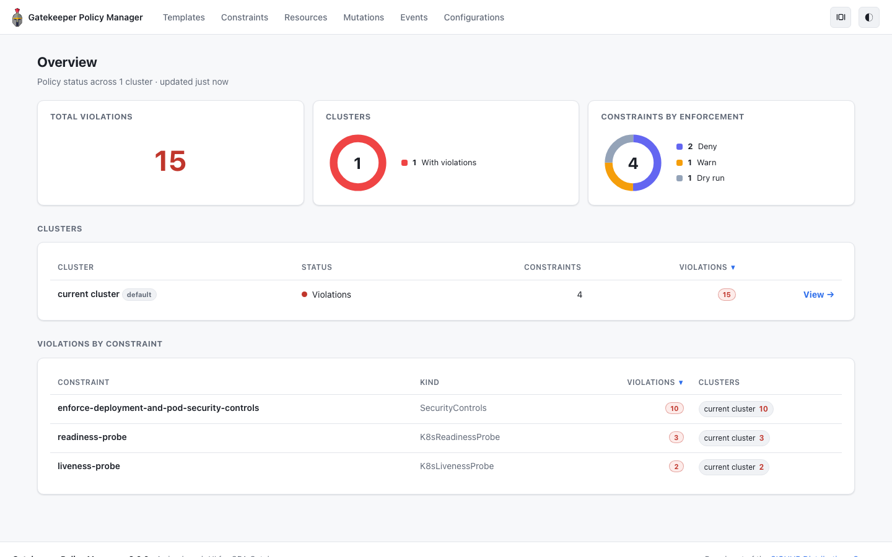
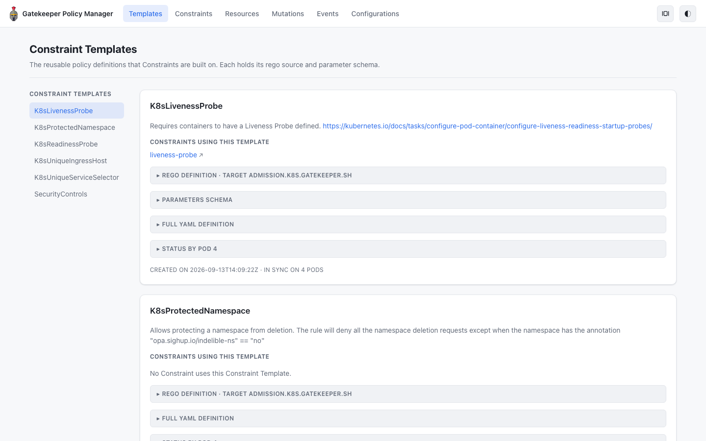
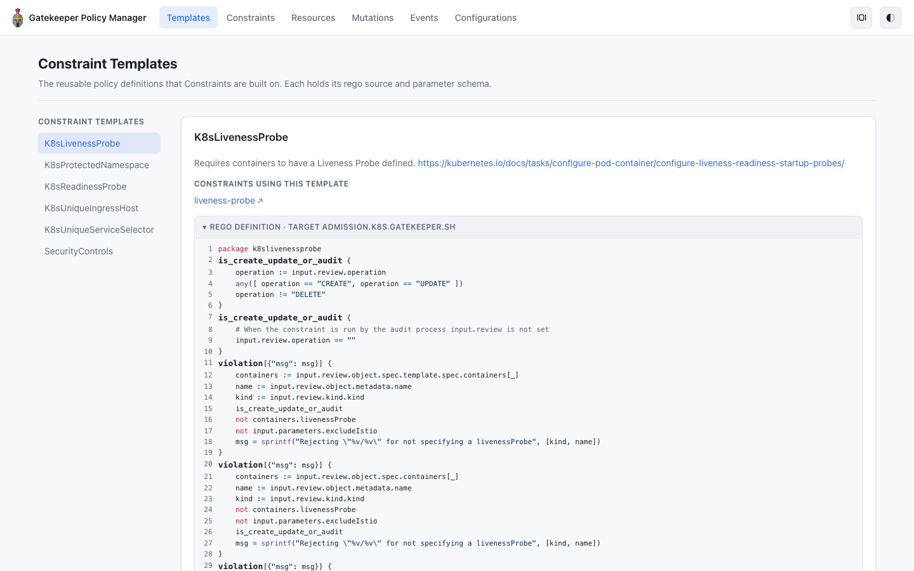
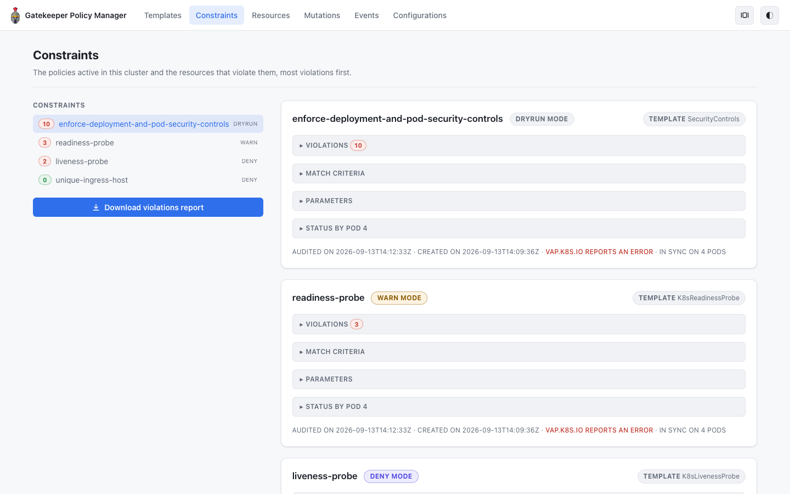
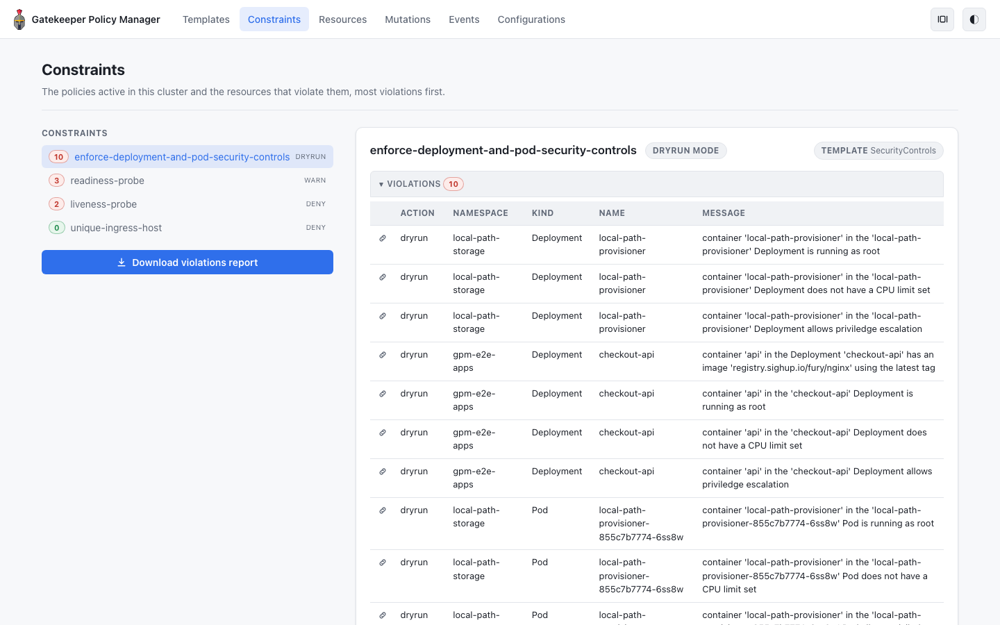
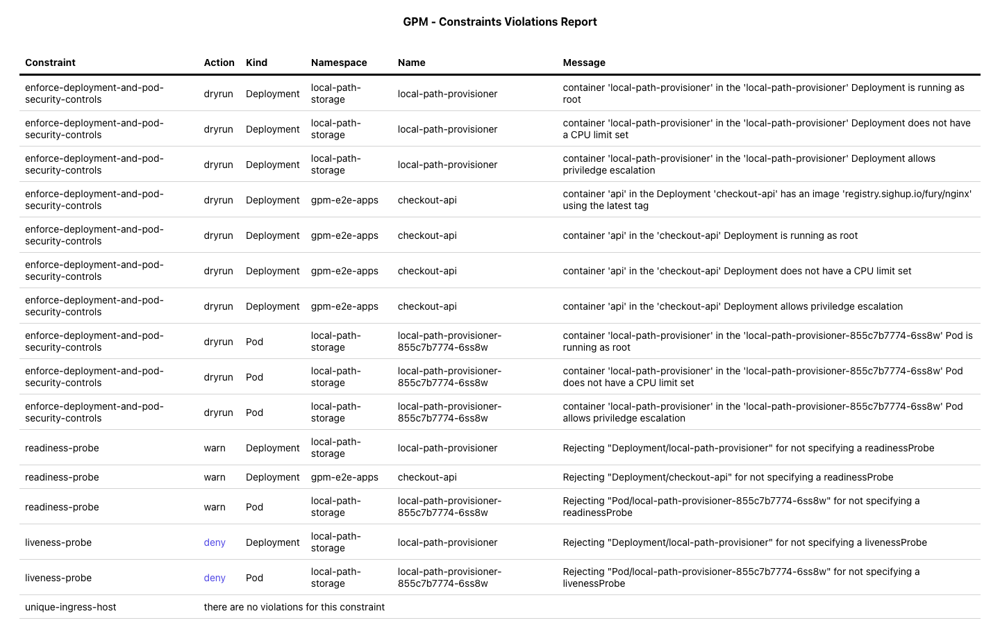
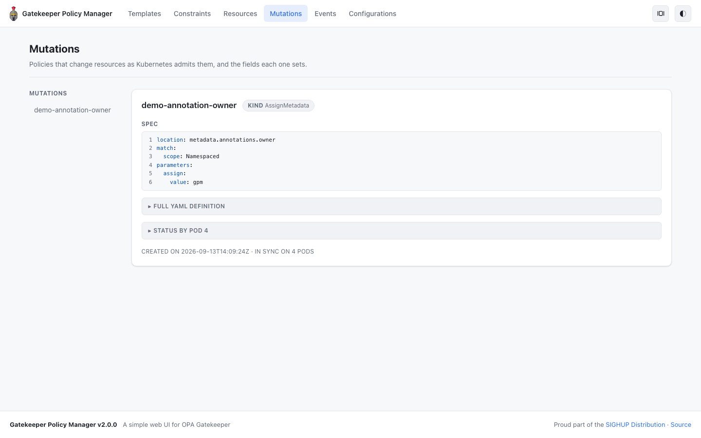
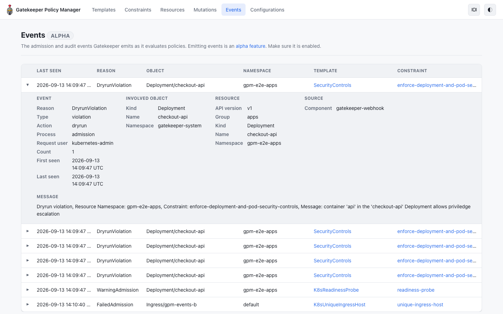
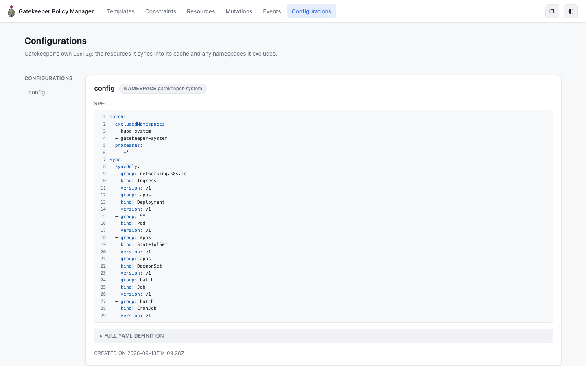

<!-- markdownlint-disable MD033 -->
<h1>
    
    Gatekeeper Policy Manager (GPM)
</h1>
<!-- markdownlint-enable MD033 -->


**Gatekeeper Policy Manager** is a *read-only* web UI that shows the status of OPA Gatekeeper policies in a Kubernetes cluster.

The target Kubernetes cluster can be the same one where GPM runs, or [a remote cluster that GPM connects to with a `kubeconfig` file](#multi-cluster-support). You can also run GPM [locally on a client machine](#running-locally) and connect to a remote cluster.

GPM lets you see in detail:

- **Constraint Templates** with their rego code.
- **Constraints** with their current status, violations, enforcement action, matches definitions, etc.
- **Mutations** defined and their details.
- **Events** emitted by OPA Gatekeeper (alpha feature).
- Gatekeeper **Configuration** custom resource values.

[You can see some screenshots below ⤵](#screenshots).

## Requirements

GPM needs OPA Gatekeeper in your cluster. It also needs some constraint templates and constraints. Without them, GPM has nothing to show.

> [!TIP]
> You can deploy Gatekeeper to your cluster with the [SIGHUP Distribution Policy Module](https://github.com/sighupio/module-policy) (also open source).

## Deploying GPM

### Deploy using Kustomize

To deploy Gatekeeper Policy Manager to your cluster, apply the [`kustomization`](kustomization.yaml) file with this command:

```shell
kubectl apply -k https://github.com/sighupio/gatekeeper-policy-manager
```

By default, this creates a deployment and a service named `gatekeeper-policy-manager` in the `gatekeeper-system` namespace. To configure more, see the `kustomization.yaml` file.

> [!NOTE]
> GPM can run as a Pod in a Kubernetes cluster, or locally with a `kubeconfig` file. It autodetects the correct configuration.

If you did not configure an ingress, use port-forward to access the web UI:

```bash
kubectl -n gatekeeper-system port-forward  svc/gatekeeper-policy-manager 8080:80
```

Then open [http://127.0.0.1:8080](http://127.0.0.1:8080) in your browser.

### Deploy using Helm

You can also deploy GPM with the [Helm chart](./chart).

First create a values file, for example `my-values.yaml`, with your custom values for the release. See the [chart's readme](./chart/README.md) and the [default values.yaml](./chart/values.yaml) for more information.

From `v2.0.0` the chart is published as an OCI artifact on `quay.io`, next to the container image. There is no `helm repo add` step any more. You need Helm 3.8 or later, which supports OCI registries. Then execute:

```bash
helm upgrade --install --namespace gatekeeper-system --set image.tag=v2.0.0-rc.1 --values my-values.yaml gatekeeper-policy-manager oci://quay.io/sighup/charts/gatekeeper-policy-manager --version 0.18.0
```

> [!IMPORTANT]
> Replace `my-values.yaml` with the path to your values file, and `--version 0.18.0` with the chart version you want.

## Running locally

You can also run GPM locally with Docker (or another container runtime) and a `kubeconfig`. If the `kubeconfig` file is at `~/.kube/config`, run this command:

```bash
docker run -v ~/.kube/config:/home/nonroot/.kube/config -p 8080:8080 quay.io/sighup/gatekeeper-policy-manager:v2.0.0-rc.1
```

Then open [http://127.0.0.1:8080](http://127.0.0.1:8080) in your browser.

You can also run the app binary directly. See the [development section](#development) for more information.

## Configuration

GPM is a stateless application. You can configure it with environment variables. The possible configurations are:

| Env Var Name         | Description                                                                                                                                                                                                                       | Default              |
| -------------------- | --------------------------------------------------------------------------------------------------------------------------------------------------------------------------------------------------------------------------------- | -------------------- |
| `GPM_LISTEN_ADDRESS` | Server listen address                                                                                                                                                                                                             | `:8080`              |
| `GPM_LOG_LEVEL`      | Log level (`DEBUG`, `INFO`, `WARN`, `ERROR`)                                                                                                                                                                                     | `INFO`               |
| `GPM_EVENTS_SOURCE`  | Comma-separated event source components to show. Gatekeeper tags admission events with `gatekeeper-webhook` and audit events with `gatekeeper-audit`.                                                                              | `gatekeeper-webhook,gatekeeper-audit` |
| `GPM_SKIP_TLS_VERIFY` | Skip TLS certificate verification while connecting to the Kubernetes API Server. Needed on clusters whose CA certificate is missing the AKI/SKI extensions, as happens on EKS. **USE WITH CAUTION.**                            | `false`              |
| `GPM_EVENTS_NAMESPACE` | Read events from this namespace only. Empty means every namespace, which needs a cluster-wide read on `events`. See [Events and RBAC](#events-and-rbac). | `` (every namespace) |
| `GPM_BASE_PATH` | The subpath for GPM, for example `/gpm`. The image sets this value from the `PUBLIC_URL` build argument. See [Running behind a reverse proxy on a subpath](#running-behind-a-reverse-proxy-on-a-subpath). | `` (the domain root) |
| `KUBECONFIG`         | Path to a [kubeconfig](https://kubernetes.io/docs/concepts/configuration/organize-cluster-access-kubeconfig/) file, if provided while running inside a cluster this configuration file will be used instead of the cluster's API. | `$HOME/.kube/config` |

### Authentication

GPM is unauthenticated by default. Set `GPM_AUTH_ENABLED` to `OIDC` to require a login.

| Env Var Name                      | Description                                                                                                                                              | Default                |
| --------------------------------- | -------------------------------------------------------------------------------------------------------------------------------------------------------- | ---------------------- |
| `GPM_AUTH_ENABLED`                | Set to `OIDC` to protect GPM with an OpenID Connect provider. Any other value leaves it open.                                                            | `Anonymous`            |
| `GPM_SECRET_KEY`                  | Key used to sign and encrypt the session cookie. **Required when authentication is on**: GPM refuses to start if it is still the 1.x default, which is published in this repository, so anyone can forge a session. | `g8k1p3rp0l1c7m4n4g3r` (the 1.x default) |
| `GPM_PREFERRED_URL_SCHEME`        | Set to `https` when GPM is served over TLS, so the session cookie is marked `Secure`. A `GPM_OIDC_REDIRECT_DOMAIN` that starts with `https://` also marks it `Secure`. | `http`                 |
| `GPM_SESSION_MAX_AGE`             | How long a session lasts, in seconds.                                                                                                                    | `28800` (8 hours)      |
| `GPM_OIDC_REDIRECT_DOMAIN`        | The public address of GPM, for example `https://gpm.example.com`. The provider sends users back to `<domain>/oidc-auth`. Required.                       |                        |
| `GPM_OIDC_CLIENT_ID`              | Client ID registered with the provider. Required.                                                                                                        |                        |
| `GPM_OIDC_CLIENT_SECRET`          | Client secret, if the client is confidential.                                                                                                            |                        |
| `GPM_OIDC_ISSUER`                 | Issuer URL. GPM reads the rest of the provider's configuration from it, unless the endpoints below are set.                                              |                        |
| `GPM_OIDC_AUTHORIZATION_ENDPOINT` | Authorization endpoint. Setting any endpoint below turns discovery off, so set them all together.                                                        |                        |
| `GPM_OIDC_TOKEN_ENDPOINT`         | Token endpoint. See the note above.                                                                                                                      |                        |
| `GPM_OIDC_JWKS_URI`               | JWKS URI. See the note above.                                                                                                                            |                        |
| `GPM_OIDC_END_SESSION_ENDPOINT`   | End session endpoint. Discovered automatically when the provider advertises one. If GPM has one, a logout from GPM also ends your session at the provider.   |                        |
| `GPM_OIDC_INTROSPECTION_ENDPOINT` | Accepted for compatibility with GPM 1.x. Not used.                                                                                                       |                        |
| `GPM_OIDC_USERINFO_ENDPOINT`      | Accepted for compatibility with GPM 1.x. Not used.                                                                                                       |                        |

> [!IMPORTANT]
> Register `<GPM_OIDC_REDIRECT_DOMAIN>/oidc-auth` as a valid redirect URI with your provider, and
> `<GPM_OIDC_REDIRECT_DOMAIN>/logout` as a valid post logout redirect URI.
>
> Set `GPM_SECRET_KEY` to a long random string. GPM will not start with the old default.
>
> Set `GPM_PREFERRED_URL_SCHEME=https` whenever GPM is reachable over HTTPS.

GPM uses PKCE, so the authorization code cannot be used by anyone who intercepts it.

The session is a cookie. GPM signs the cookie and also encrypts it, so the contents are not
readable. GPM derives the two keys for this from `GPM_SECRET_KEY` with HKDF. Every replica derives
the same keys from the same secret, and so does the same replica after a restart.

> [!NOTE]
> GPM does not keep sessions on the server. A logout clears the cookie in your browser. When the
> provider supports it, GPM also ends the session at the provider. But GPM cannot cancel a copy of
> the cookie that someone took to a different machine. Such a copy stays valid until
> `GPM_SESSION_MAX_AGE` expires it. If this risk is a problem for you, use a short value.
>
> On a subpath deployment the cookie is scoped to that subpath. A different application on
> the same host does not receive it.

Once authentication is on, everything requires a session except these paths, which have to stay
reachable for a user who is not logged in yet:

| Path | Why it is open |
| --- | --- |
| `/health` | the liveness and readiness probes run without credentials |
| `/login`, `/oidc-auth`, `/logout` | the login flow itself |
| `/metrics` | Prometheus scrapes it. It holds request counters only, no policy data |
| `/static/*`, `/favicon.ico` | the assets the login and logout pages need |

Everything else — every page, including the list of clusters — needs a valid session.

When the session expires, GPM sends the user to `/login` to sign in again. The login route accepts
`?next=` with a same-site path that says where the user lands after signing in.

### Running behind a reverse proxy on a subpath

GPM assumes by default that it is served from the domain root. If you put it behind a reverse proxy
on a subpath, for example `example.com/gpm`, set the `GPM_BASE_PATH` environment variable to that
subpath. GPM prepends it to the paths it hands the browser: the asset URLs, the login URL and the
OIDC redirects.

You can also set the subpath at build time with the `PUBLIC_URL` build argument, which sets
`GPM_BASE_PATH` in the image:

```bash
docker build --build-arg PUBLIC_URL=/gpm -t gatekeeper-policy-manager:subpath .
```

If you set neither, GPM runs at the domain root, as before.

> [!IMPORTANT]
> Configure your reverse proxy to **strip the subpath** before forwarding to GPM. GPM matches its
> routes at the root, so it expects to receive `/constraints` and `/static/...`, not
> `/gpm/constraints`. With nginx, a `proxy_pass` ending in a slash does this for you.

The image published on quay.io is built for the root path. If you need a subpath deployment, build
your own image with the argument above and push it to your own registry, or reference the
Dockerfile from your CI pipeline with the same `--build-arg`.

If you enable OIDC, keep `GPM_OIDC_REDIRECT_DOMAIN` as the scheme and host only, for example
`https://example.com`. GPM adds the subpath. Register `https://example.com/gpm/oidc-auth` with your
provider as the redirect URI.

### Events and RBAC

The events view reads the `events` resource of the Kubernetes core API. By default GPM reads events
from every namespace. This needs a `ClusterRole` with read access to `events` in the whole cluster,
which is more access than the other views need.

To make the access smaller, set `GPM_EVENTS_NAMESPACE` to the namespace that OPA Gatekeeper runs
in, usually `gatekeeper-system`. Then GPM reads events from that namespace only. You can move the
read on `events` out of the `ClusterRole` and into a `Role` in that namespace.

The Helm chart does both steps for you. Set `config.eventsNamespace` and the chart removes `events`
from the `ClusterRole`. The chart then creates a `Role` and a `RoleBinding` in the namespace that
you named.

> [!NOTE]
> `GPM_EVENTS_NAMESPACE` has priority over the `?namespace=` parameter of the events endpoint. A
> request cannot read a namespace that the deployment is not configured for.

### Multi-cluster support

GPM can show information from more than one cluster. To use this, provide a `kubeconfig` with more than one context. Each context points to a different cluster. GPM lets you choose the context (cluster) from the UI.

To run GPM in a cluster with multi-cluster support, do these steps:

1. Mount a `kubeconfig` file with the cluster access configuration in the GPM pods.
2. Set the `KUBECONFIG` environment variable to the path of the mounted `kubeconfig` file. Or mount it at `/home/nonroot/.kube/config`, and GPM detects it automatically.

> [!IMPORTANT]
> The user for the clusters must have the correct permissions. Use the [`manifests/rbac.yaml`](manifests/rbac.yaml) file as a reference.
>
> The cluster where GPM runs must reach the other clusters. This needs network connectivity.

When you run GPM locally, you already use a `kubeconfig` file to connect to the clusters. You see all your contexts and can switch between them from the UI.

#### AWS IAM Authentication

To use a kubeconfig with IAM authentication, you must customize the GPM container image. The IAM authentication uses external AWS binaries. The image does not include them by default.

You can customize the container image with a `Dockerfile` like this one:

```Dockerfile
FROM curlimages/curl:7.81.0 as downloader
RUN curl https://github.com/kubernetes-sigs/aws-iam-authenticator/releases/download/v0.5.5/aws-iam-authenticator_0.5.5_linux_amd64 --output /tmp/aws-iam-authenticator
RUN chmod +x /tmp/aws-iam-authenticator

FROM quay.io/sighup/gatekeeper-policy-manager:v2.0.0-rc.1
COPY --from=downloader --chown=root:root /tmp/aws-iam-authenticator /usr/local/bin/
```

You can also add the `aws` CLI for debugging. Use the same approach as before.

> [!NOTE]
> Make sure that your `kubeconfig` has the `apiVersion` set as `client.authentication.k8s.io/v1beta1`
>
> You can read more [in this issue](https://github.com/sighupio/gatekeeper-policy-manager/issues/330).

## Screenshots

<!-- markdownlint-disable MD033 -->
<a href="screenshots/home.png"></a>
<a href="screenshots/constraint-templates-01.png"></a>
<a href="screenshots/constraint-templates-02.png"></a>
<a href="screenshots/constraints-01.png"></a>
<a href="screenshots/constraints-02.png"></a>
<a href="screenshots/violations-report.png"></a>
<a href="screenshots/mutations.png"></a>
<a href="screenshots/events.png"></a>
<a href="screenshots/configurations.png"></a>
<!-- markdownlint-enable MD033 -->

## Development

GPM is written in Go. It uses the Echo framework and renders the UI on the server with the standard
library's `html/template`, plus a small amount of Alpine.js for interactivity. There is no separate
frontend build.

Alpine.js is vendored as `static/ssr/alpine.min.js`. Its version is pinned in `package.json` so
Dependabot tracks it; after a bump, run `mise run vendor-alpine` to refresh the vendored file (the
`check-alpine-version` task, part of `mise run lint`, fails if the two drift).

To develop GPM, run these commands:

```bash
# Install the dependencies
$ go mod download
# Run the development server
$ GPM_LOG_LEVEL=DEBUG go run .
```

> [!TIP]
> A Kubernetes cluster with OPA Gatekeeper deployed helps you debug the application.

## Contributing

Let us know if you use GPM and which features you want. Create an issue here on GitHub 💪🏻

To contribute, pick one of the open issues and work on it. It is better to tell us first on the issue.

When you are happy with your work, open a Pull Request.

> We try to stick to [conventional commits](https://www.conventionalcommits.org/en/v1.0.0/) when writing commit messages.
