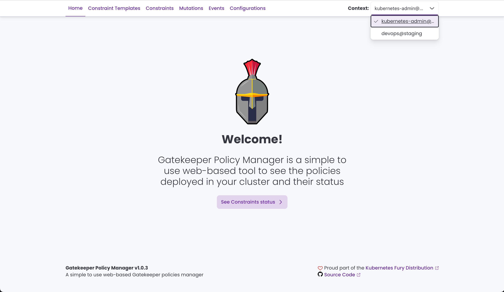

<!-- markdownlint-disable MD033 -->
<h1>
    
    Gatekeeper Policy Manager (GPM)
</h1>
<!-- markdownlint-enable MD033 -->

[](https://ci.sighup.io/sighupio/gatekeeper-policy-manager)


**Gatekeeper Policy Manager** is a simple *read-only* web UI for viewing OPA Gatekeeper policies' status in a Kubernetes Cluster.

The target Kubernetes Cluster can be the same where GPM is running or some other [remote cluster(s) using a `kubeconfig` file](#multi-cluster-support). You can also run GPM [locally in a client machine](#running-locally) and connect to a remote cluster.

GPM lets you see in detail:

- **Constraint Templates** with their rego code.
- **Constraints** with their current status, violations, enforcement action, matches definitions, etc.
- **Mutations** defined and their details.
- **Events** emitted by OPA Gatekeeper (alpha feature).
- Gatekeeper **Configuration** custom resource values.

[You can see some screenshots below ⤵](#screenshots).

## Requirements

You'll need OPA Gatekeeper running in your cluster and at least some constraint templates and constraints defined to take advantage of this tool.

> [!TIP]
> You can easily deploy Gatekeeper to your cluster using the (also open source) [SIGHUP Distribution Policy Module](https://github.com/sighupio/module-policy).

## Deploying GPM

### Deploy using Kustomize

To deploy Gatekeeper Policy Manager to your cluster, apply the provided [`kustomization`](kustomization.yaml) file running the following command:

```shell
kubectl apply -k .
```

By default, this will create a deployment and a service both with the name `gatekeper-policy-manager` in the `gatekeeper-system` namespace. We invite you to take a look into the `kustomization.yaml` file to do further configuration.

> [!NOTE]
> GPM can run as a POD in a Kubernetes cluster or locally with a `kubeconfig` file. It will try its best to autodetect the correct configuration.

Once you've deployed the application, if you haven't set up an ingress, you can access the web UI using port-forward:

```bash
kubectl -n gatekeeper-system port-forward  svc/gatekeeper-policy-manager 8080:80
```

Then access it with your browser by visiting [http://127.0.0.1:8080](http://127.0.0.1:8080).

### Deploy using Helm

It is also possible to deploy GPM using the [provided Helm Chart](./chart).

First create a values file, for example `my-values.yaml`, with your custom values for the release. See the [chart's readme](./chart/README.md) and the [default values.yaml](./chart/values.yaml) for more information.

Then, execute:

```bash
helm repo add gpm https://sighupio.github.io/gatekeeper-policy-manager
helm upgrade --install --namespace gatekeeper-system --set image.tag=v2.0.0-alpha1 --values my-values.yaml gatekeeper-policy-manager gpm/gatekeeper-policy-manager
```

> [!IMPORTANT]
> Don't forget to replace `my-values.yaml` with the path to your values file.

## Running locally

GPM can also be run locally using Docker (or any other container runtime) and a `kubeconfig`. Assuming that the `kubeconfig` file you want to use is located at `~/.kube/config` the command to run GPM locally would be:

```bash
docker run -v ~/.kube/config:/home/nonroot/.kube/config -p 8080:8080 quay.io/sighup/gatekeeper-policy-manager:v2.0.0-alpha1
```

Then access it with your browser by visiting [http://127.0.0.1:8080](http://127.0.0.1:8080).

You can also run the app binary directly, see the [development section](#development) for further information.

## Configuration

GPM is a stateless application, but it can be configured using environment variables. The possible configurations are:

| Env Var Name         | Description                                                                                                                                                                                                                       | Default              |
| -------------------- | --------------------------------------------------------------------------------------------------------------------------------------------------------------------------------------------------------------------------------- | -------------------- |
| `GPM_LISTEN_ADDRESS` | Server listen address                                                                                                                                                                                                             | `:8080`              |
| `GPM_LOG_LEVEL`      | Log level (`DEBUG`, `INFO`, `WARN`, `ERROR`)                                                                                                                                                                                     | `INFO`               |
| `GPM_EVENTS_SOURCE`  | Used to filter out events by the defined source                                                                                                                                                                                   | `gatekeeper-webhook` |
| `GPM_SKIP_TLS_VERIFY` | Skip TLS certificate verification while connecting to the Kubernetes API Server. Needed on clusters whose CA certificate is missing the AKI/SKI extensions, as happens on EKS. **USE WITH CAUTION.**                            | `false`              |
| `GPM_EVENTS_NAMESPACE` | Read events from this namespace only. Empty means every namespace, which needs a cluster-wide read on `events`. See [Events and RBAC](#events-and-rbac). | `` (every namespace) |
| `GPM_BASE_PATH` | The subpath for GPM, for example `/gpm`. The image sets this value from the `PUBLIC_URL` build argument. See [Running behind a reverse proxy on a subpath](#running-behind-a-reverse-proxy-on-a-subpath). | `` (the domain root) |
| `KUBECONFIG`         | Path to a [kubeconfig](https://kubernetes.io/docs/concepts/configuration/organize-cluster-access-kubeconfig/) file, if provided while running inside a cluster this configuration file will be used instead of the cluster's API. | `$HOME/.kube/config` |

### Authentication

GPM is unauthenticated by default. Set `GPM_AUTH_ENABLED` to `OIDC` to require a login.

| Env Var Name                      | Description                                                                                                                                              | Default                |
| --------------------------------- | -------------------------------------------------------------------------------------------------------------------------------------------------------- | ---------------------- |
| `GPM_AUTH_ENABLED`                | Set to `OIDC` to protect GPM with an OpenID Connect provider. Any other value leaves it open.                                                            | `Anonymous`            |
| `GPM_SECRET_KEY`                  | Key used to sign and encrypt the session cookie. **Required when authentication is on**: GPM refuses to start if it is still the 1.x default, which is published in this repository and would let anyone forge a session. | *(none)*               |
| `GPM_PREFERRED_URL_SCHEME`        | Set to `https` when GPM is served over TLS, so the session cookie is marked `Secure`. A `GPM_OIDC_REDIRECT_DOMAIN` that starts with `https://` also marks it `Secure`. | `http`                 |
| `GPM_SESSION_MAX_AGE`             | How long a session lasts, in seconds.                                                                                                                    | `28800` (8 hours)      |
| `GPM_OIDC_REDIRECT_DOMAIN`        | The public address of GPM, for example `https://gpm.example.com`. The provider sends users back to `<domain>/oidc-auth`. Required.                       |                        |
| `GPM_OIDC_CLIENT_ID`              | Client ID registered with the provider. Required.                                                                                                        |                        |
| `GPM_OIDC_CLIENT_SECRET`          | Client secret, if the client is confidential.                                                                                                            |                        |
| `GPM_OIDC_ISSUER`                 | Issuer URL. GPM reads the rest of the provider's configuration from it, unless the endpoints below are set.                                              |                        |
| `GPM_OIDC_AUTHORIZATION_ENDPOINT` | Authorization endpoint. Setting any endpoint below turns discovery off, so set them all together.                                                        |                        |
| `GPM_OIDC_TOKEN_ENDPOINT`         | Token endpoint. See the note above.                                                                                                                      |                        |
| `GPM_OIDC_JWKS_URI`               | JWKS URI. See the note above.                                                                                                                            |                        |
| `GPM_OIDC_END_SESSION_ENDPOINT`   | End session endpoint. Discovered automatically when the provider advertises one. If GPM has one, logging out of GPM also logs you out of the provider.   |                        |
| `GPM_OIDC_INTROSPECTION_ENDPOINT` | Accepted for compatibility with GPM 1.x. Not used.                                                                                                       |                        |
| `GPM_OIDC_USERINFO_ENDPOINT`      | Accepted for compatibility with GPM 1.x. Not used.                                                                                                       |                        |

> [!IMPORTANT]
> Register `<GPM_OIDC_REDIRECT_DOMAIN>/oidc-auth` as a valid redirect URI with your provider, and
> `<GPM_OIDC_REDIRECT_DOMAIN>/logout` as a valid post logout redirect URI.
>
> Set `GPM_SECRET_KEY` to a long random string. GPM will not start with the old default.
>
> Set `GPM_PREFERRED_URL_SCHEME=https` whenever GPM is reachable over HTTPS.

GPM uses PKCE, so the authorization code cannot be used by anyone who intercepts it.

The session is a cookie. GPM signs the cookie and also encrypts it, so the contents are not
readable. GPM derives the two keys for this from `GPM_SECRET_KEY` with HKDF. Every replica derives
the same keys from the same secret, and so does the same replica after a restart.

> [!NOTE]
> GPM does not keep sessions on the server. A logout clears the cookie in your browser. When the
> provider supports it, GPM also ends the session at the provider. But GPM cannot cancel a copy of
> the cookie that someone took to a different machine. Such a copy stays valid until
> `GPM_SESSION_MAX_AGE` expires it. If this risk is a problem for you, use a short value.
>
> On a subpath deployment the cookie is scoped to that subpath. A different application on
> the same host does not receive it.

Once authentication is on, everything requires a session except these paths, which have to stay
reachable for a user who is not logged in yet:

| Path | Why it is open |
| --- | --- |
| `/health` | the liveness and readiness probes run without credentials |
| `/api/v1/auth` | the frontend asks whether there is anything to log into before showing a login |
| `/login`, `/oidc-auth`, `/logout` | the login flow itself |
| `/metrics` | Prometheus scrapes it; it holds request counters only, no policy data |
| `/static/*`, `/favicon.ico`, `/manifest.json`, `/touch-icon.png` | assets the login and logout pages need |

Everything else — every page and every other API endpoint, including the list of clusters — needs a
valid session.

Requests under `/api/` answer `401` when the session has expired, rather than redirecting, so that
`fetch()` gets a readable error instead of an opaque cross-origin failure. Send users to `/login`
to sign in again; it accepts `?next=` with a same-site path to say where they should land.

### Running behind a reverse proxy on a subpath

GPM assumes by default that it is served from the domain root. If you put it behind a reverse proxy
on a subpath, for example `example.com/gpm`, set the `PUBLIC_URL` build argument when building the
image so the frontend's router and API calls use that subpath instead of `/`:

```bash
docker build --build-arg PUBLIC_URL=/gpm -t gatekeeper-policy-manager:subpath .
```

This uses [Create React App's standard `PUBLIC_URL` mechanism](https://create-react-app.dev/docs/using-the-public-folder/).
The build puts the subpath into the assets: the router's `basename`, the API base path, and every
in-app link.

The same argument sets `GPM_BASE_PATH` in the image. The backend uses this value for the paths that
it sends to the browser. These paths are the login URL and the OIDC redirects. You do not have to
set `GPM_BASE_PATH`. If you set it to a different value than `PUBLIC_URL`, the links go to the
wrong address. If you do not set `PUBLIC_URL`, GPM runs at the domain root, as before.

> [!IMPORTANT]
> Configure your reverse proxy to **strip the subpath** before forwarding to GPM. The backend still
> serves everything from the root, so it expects to receive `/api/v1/...` and `/static/...`, not
> `/gpm/api/v1/...`. With nginx, a `proxy_pass` ending in a slash does this for you.

The image published on quay.io is built for the root path. If you need a subpath deployment, build
your own image with the argument above and push it to your own registry, or reference the
Dockerfile from your CI pipeline with the same `--build-arg`.

If you enable OIDC, keep `GPM_OIDC_REDIRECT_DOMAIN` as the scheme and host only, for example
`https://example.com`. GPM adds the subpath. Register `https://example.com/gpm/oidc-auth` with your
provider as the redirect URI.

### Events and RBAC

The events view reads the `events` resource of the Kubernetes core API. By default GPM reads events
from every namespace. This needs a `ClusterRole` with read access to `events` in the whole cluster,
which is more access than the other views need.

To make the access smaller, set `GPM_EVENTS_NAMESPACE` to the namespace that OPA Gatekeeper runs
in, usually `gatekeeper-system`. Then GPM reads events from that namespace only. You can move the
read on `events` out of the `ClusterRole` and into a `Role` in that namespace.

The Helm chart does both steps for you. Set `config.eventsNamespace` and the chart removes `events`
from the `ClusterRole`. The chart then creates a `Role` and a `RoleBinding` in the namespace that
you named.

> [!NOTE]
> `GPM_EVENTS_NAMESPACE` has priority over the `?namespace=` parameter of the events endpoint. A
> request cannot read a namespace that the deployment is not configured for.

### Multi-cluster support

GPM supports viewing information from more than one cluster. Multi-cluster support is achieved by using a `kubeconfig` with more than one context, where each context points to a different cluster. GPM will let you choose the context (cluster) from the UI.

If you want to run GPM in a cluster but with multi-cluster support, do as follows:

1. Mounting a `kubeconfig` file in GPM's pod(s) with the cluster access configuration.
2. Setting the environment variable `KUBECONFIG` value with the path to the mounted `kubeconfig` file. Or you can simply mount it in `/home/nonroot/.kube/config` and GPM will detect it automatically.

> ⚠️ Please remember that the user for the clusters should have the proper permissions. You can use the [`manifests/rabc.yaml`](manifests/rbac.yaml) file as reference.
>
> Also note that the cluster where GPM is running should be able to reach the other clusters, i.e. network connectivity.

When you run GPM locally, you are already using a `kubeconfig` file to connect to the clusters, you should see all your defined contexts and be able to switch between them easily from the UI.

#### AWS IAM Authentication

If you want to use a kubeconfig with IAM Authentication, you'll need to customize GPM's container image because the IAM authentication uses external AWS binaries that are not included by default in the image.

You can customize the container image with a `Dockerfile` like the following:

```Dockerfile
FROM curlimages/curl:7.81.0 as downloader
RUN curl https://github.com/kubernetes-sigs/aws-iam-authenticator/releases/download/v0.5.5/aws-iam-authenticator_0.5.5_linux_amd64 --output /tmp/aws-iam-authenticator
RUN chmod +x /tmp/aws-iam-authenticator

FROM quay.io/sighup/gatekeeper-policy-manager:v2.0.0-alpha1
COPY --from=downloader --chown=root:root /tmp/aws-iam-authenticator /usr/local/bin/
```

You may need to add also the `aws` CLI for debugging purposes, you can use the same approach as before.

> [!NOTE]
> Make sure that your `kubeconfig` has the `apiVersion` set as `client.authentication.k8s.io/v1beta1`
>
> You can read more [in this issue](https://github.com/sighupio/gatekeeper-policy-manager/issues/330).

## Screenshots

<!-- markdownlint-disable MD033 -->
<a href="screenshots/home.png"></a>
<a href="screenshots/constraint-templates-01.png"></a>
<a href="screenshots/constraint-templates-02.png"></a>
<a href="screenshots/constraints-01.png"></a>
<a href="screenshots/constraints-02.png"></a>
<a href="screenshots/violations-report.png"></a>
<a href="screenshots/mutations.png"></a>
<a href="screenshots/events.png"></a>
<a href="screenshots/configurations.png"></a>
<a href="screenshots/multicluster.png"></a>
<!-- markdownlint-enable MD033 -->

## Development

GPM is written in Go using the Echo framework for the backend and React with Elastic UI and the Fury theme for the frontend.

To develop GPM, the following commands should get you ready to start hacking:

```bash
# Build Frontend and copy over to static folder
$ pushd web-client
$ yarn install && yarn build
$ cp -r build/* ../static-content/
$ popd
# Install the Backend dependencies
$ go mod download
# Run the development server
$ APP_ENV=development GPM_LOG_LEVEL=DEBUG go run main.go
```

> [!TIP]
> Access to a Kubernetes cluster with OPA Gatekeeper deployed is recommended to debug the application.

## Contributing

Please, let us know if you are using GPM and what features would you like to have by creating an issue here on GitHub 💪🏻

To contribute to GPM's development you can pick one of the open issues and work on it, it is better if you write on the issue letting us know first.

Once you are happy with your work, feel free to open a Pull Request.

> We try to stick to [conventional commits](https://www.conventionalcommits.org/en/v1.0.0/) when writing commit messages.
